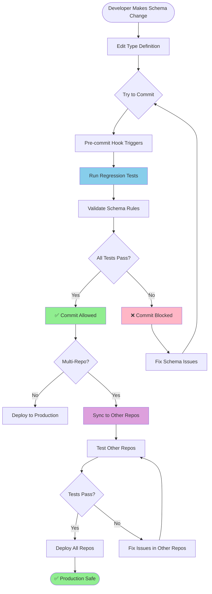
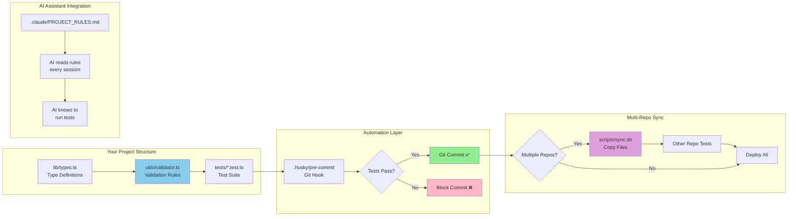
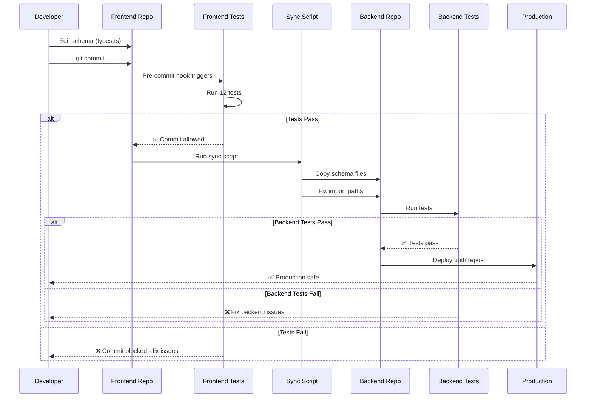

# How to Build a Regression Testing Harness for Your Project

**Author:** Replicant Partners  
**Date:** 2026-02-03  
**Use Case:** Multi-repo projects with shared schemas/types that need to stay in sync

## What This Guide Covers

This guide shows you how to build a comprehensive regression testing system that:
- Prevents schema-breaking changes from being deployed
- Keeps multiple repositories in sync (e.g., mobile + backend)
- Works automatically on every commit via git hooks
- Integrates with AI coding assistants (Claude Code, Cursor, etc.)

## Why You Need This

**The Problem:**
- Frontend uses `User` interface with field `email` (example - customize for your domain)
- Backend deploys without `email` field
- Production breaks 💥

**The Solution:**
- Automated tests run on every commit
- Tests verify schema consistency
- Commits blocked if schemas don't match
- Multiple repos stay in sync automatically

## Visual Overview



## Architecture Overview



## Step-by-Step Build Guide

> **⚠️ IMPORTANT: This guide uses example code from our forecasting app.**
> 
> **You MUST customize for your project.** Look for 🔧 markers in code examples.

### Customization Checklist

Before starting, identify these for your project:

| What to Customize | Our Example | Your Project |
|-------------------|-------------|--------------|
| **Main Type** | `Driver`, `Forecast` | `User`, `Product`, `Order`, etc. |
| **Key Fields** | `direction`, `probability`, `version` | `email`, `price`, `status`, etc. |
| **ID Format** | `drv_xxxxxxxxxxxx` (nanoid with prefix) | UUID? Numeric? Custom? |
| **Validation Rules** | Probability 0-1, required direction | Email format? Price > 0? |
| **File Paths** | `src/utils/`, `lib/` | Match your project structure |
| **Backend Repo?** | Yes (`uffp-backend`) | Single repo? Multi-repo? |

### Phase 1: Create Schema Validator (30 min)

#### 1.1 Create the Validator File

**Location:** `src/utils/schemaValidator.ts` (or `lib/schemaValidator.ts`)

> 💡 **Customize for your project:**
> - Replace `YourMainType` with your primary data type (e.g., `User`, `Product`, `Order`)
> - Adjust import paths to match your project structure
> - Add validation rules specific to your domain

```typescript
// src/utils/schemaValidator.ts
// 🔧 CUSTOMIZE: Import your actual types here
import type { YourMainType } from '../types';  // <- Change to your type!

export interface ValidationError {
  entity: string;      // e.g., "Driver", "User"
  entityId: string;    // The ID of the problematic entity
  field: string;       // Which field has the issue
  rule: string;        // What rule was violated
}

export interface ValidationResult {
  valid: boolean;
  errors: ValidationError[];
  warnings: ValidationError[];
}

// Main validation function
export function validateYourType(data: YourMainType): ValidationResult {
  const errors: ValidationError[] = [];
  const warnings: ValidationError[] = [];

  // Example: Check required fields
  if (!data.id) {
    errors.push({
      entity: 'YourType',
      entityId: data.id || 'unknown',
      field: 'id',
      rule: 'ID is required'
    });
  }

  // Example: Check field format
  if (data.id && !data.id.startsWith('prefix_')) {
    warnings.push({
      entity: 'YourType',
      entityId: data.id,
      field: 'id',
      rule: 'ID should use prefix format (prefix_xxxxx)'
    });
  }

  return {
    valid: errors.length === 0,
    errors,
    warnings
  };
}

// Helper to format results for display
export function formatValidationResults(result: ValidationResult): string {
  let output = '';
  
  if (!result.valid) {
    output += `❌ Schema validation failed\n\n`;
    output += `Errors (${result.errors.length}):\n`;
    result.errors.forEach(e => {
      output += `  - [${e.entity}:${e.entityId}] ${e.field}: ${e.rule}\n`;
    });
  }
  
  if (result.warnings.length > 0) {
    output += `\nWarnings (${result.warnings.length}):\n`;
    result.warnings.forEach(w => {
      output += `  - [${w.entity}:${w.entityId}] ${w.field}: ${w.rule}\n`;
    });
  }
  
  return output;
}
```

#### 1.2 Add Validation Rules

Add rules for your specific domain. Examples below show common patterns:

> 💡 **Customize these validation rules for your project:**
> - Change field names to match your schema (e.g., `email`, `age`, `price`)
> - Adjust validation logic for your business rules
> - Add domain-specific constraints (e.g., email format, price ranges)

```typescript
// 🔧 EXAMPLE: ID format validation (customize the pattern for your IDs)
// In our project: We use "prefix_xxxxxxxxxxxx" format
// Your project might use: UUIDs, numeric IDs, or custom formats
if (data.id && !/^prefix_[a-zA-Z0-9]{12}$/.test(data.id)) {
  warnings.push({
    entity: 'YourType',
    entityId: data.id,
    field: 'id',
    rule: 'ID should match format: prefix_xxxxxxxxxxxx'
  });
}

// Range validation
if (data.probability < 0 || data.probability > 1) {
  errors.push({
    entity: 'YourType',
    entityId: data.id,
    field: 'probability',
    rule: 'Probability must be between 0 and 1'
  });
}

// Required field validation
if (!data.requiredField) {
  errors.push({
    entity: 'YourType',
    entityId: data.id,
    field: 'requiredField',
    rule: 'This field is required'
  });
}

// Referential integrity
if (data.foreignKeyId && !parentExists(data.foreignKeyId)) {
  errors.push({
    entity: 'YourType',
    entityId: data.id,
    field: 'foreignKeyId',
    rule: `Referenced entity ${data.foreignKeyId} does not exist`
  });
}
```

### Phase 2: Create Test Suite (45 min)

#### 2.1 Install Test Dependencies

```bash
npm install -D tsx  # For running TypeScript tests
```

#### 2.2 Create Schema Validation Tests

**Location:** `tests/schemaValidator.test.ts`

> 💡 **Customize for your project:**
> - Replace test data with realistic examples from your domain
> - Test the specific fields and constraints that matter to your business
> - Add tests for edge cases specific to your use case

```typescript
// tests/schemaValidator.test.ts
// 🔧 CUSTOMIZE: Import your validator and types
import { validateYourType, formatValidationResults } from '../src/utils/schemaValidator';
import type { YourMainType } from '../types';  // <- Your actual type!

console.log('🧪 Running Schema Validation Tests\n');
console.log('='.repeat(60) + '\n');

let passedTests = 0;
let failedTests = 0;

// 🔧 Test 1: Valid data should pass
// CUSTOMIZE: Replace with valid data for YOUR type
console.log('✓ Test 1: Valid data');
const validData: YourMainType = {
  id: 'prefix_abc123456789',      // <- Your ID format
  requiredField: 'value',          // <- Your required fields
  probability: 0.5,                 // <- Your numeric fields
  // ... add ALL required fields for your type
};

const result1 = validateYourType(validData);
if (result1.valid) {
  console.log('✅ PASSED\n');
  passedTests++;
} else {
  console.log('❌ FAILED');
  console.log(formatValidationResults(result1));
  failedTests++;
}

// Test 2: Invalid data should fail
console.log('✓ Test 2: Invalid data (missing required field)');
const invalidData: any = {
  id: 'prefix_abc123456789',
  // Missing requiredField
  probability: 0.5,
};

const result2 = validateYourType(invalidData);
if (!result2.valid && result2.errors.length > 0) {
  console.log('✅ PASSED: Detected missing required field\n');
  passedTests++;
} else {
  console.log('❌ FAILED: Should have detected missing field\n');
  failedTests++;
}

// Test 3: Out of range values
console.log('✓ Test 3: Out of range probability');
const outOfRange: YourMainType = {
  id: 'prefix_abc123456789',
  requiredField: 'value',
  probability: 1.5,  // Invalid: > 1
};

const result3 = validateYourType(outOfRange);
if (!result3.valid) {
  console.log('✅ PASSED: Detected out of range value\n');
  passedTests++;
} else {
  console.log('❌ FAILED: Should have detected invalid range\n');
  failedTests++;
}

// Add more tests...

// Summary
console.log('='.repeat(60));
console.log(`📊 Test Summary: ${passedTests} passed, ${failedTests} failed\n`);

if (failedTests > 0) {
  console.log('❌ Some tests failed!');
  process.exit(1);
} else {
  console.log('✅ All tests passed!');
  process.exit(0);
}
```

#### 2.3 Add NPM Test Scripts

**Location:** `package.json`

```json
{
  "scripts": {
    "test": "npm run test:all",
    "test:all": "npm run test:schema",
    "test:schema": "npx tsx tests/schemaValidator.test.ts"
  }
}
```

#### 2.4 Test Your Tests

```bash
npm run test:schema
```

Should output:
```
🧪 Running Schema Validation Tests
✓ Test 1: Valid data
✅ PASSED
✓ Test 2: Invalid data
✅ PASSED
...
📊 Test Summary: 8 passed, 0 failed
✅ All tests passed!
```

### Phase 3: Add Pre-commit Hooks (15 min)

#### 3.1 Install Husky

```bash
npm install -D husky
npx husky init
```

#### 3.2 Create Pre-commit Hook

**Location:** `.husky/pre-commit`

```bash
#!/usr/bin/env sh

echo "🔍 Running schema validation tests..."
npm run test:schema

echo "✅ All schema validation tests passed!"
```

#### 3.3 Make It Executable

```bash
chmod +x .husky/pre-commit
```

#### 3.4 Test the Hook

```bash
# Make a dummy change
echo "# test" >> README.md
git add README.md
git commit -m "Test pre-commit hook"

# Should see:
# 🔍 Running schema validation tests...
# 🧪 Running Schema Validation Tests
# ...
# ✅ All tests passed!

# Undo the test
git reset HEAD~1
```

### Phase 4: Multi-Repo Sync (30 min)

**Only needed if you have multiple repos sharing schemas (e.g., mobile + backend)**

#### Multi-Repo Architecture



#### 4.1 Create Sync Script

**Location:** `scripts/sync-schemas.sh`

```bash
#!/bin/bash

set -e

# Directories
SOURCE_DIR="$(cd "$(dirname "${BASH_SOURCE[0]}")/.." && pwd)"
TARGET_DIR="${SOURCE_DIR}/../your-backend-repo"

# Check target exists
if [ ! -d "$TARGET_DIR" ]; then
  echo "❌ Backend repo not found at $TARGET_DIR"
  exit 1
fi

echo "📋 Syncing schemas from frontend to backend..."
echo "  Source: $SOURCE_DIR"
echo "  Target: $TARGET_DIR"
echo ""

# Copy schema files
cp "$SOURCE_DIR/src/types.ts" "$TARGET_DIR/lib/types.ts"
cp "$SOURCE_DIR/src/utils/schemaValidator.ts" "$TARGET_DIR/lib/schemaValidator.ts"

echo "✅ Files synced!"
echo ""
echo "Next steps:"
echo "1. cd $TARGET_DIR"
echo "2. npm run test:all"
echo "3. git commit -am 'Sync schemas' && git push"
```

#### 4.2 Make It Executable

```bash
chmod +x scripts/sync-schemas.sh
```

#### 4.3 Set Up Backend Repo

In your backend repo, repeat Phase 2 and Phase 3:
1. Copy the test files
2. Fix import paths (frontend uses `src/`, backend might use `lib/`)
3. Install husky and set up pre-commit hook
4. Run tests to verify

### Phase 5: AI Assistant Integration (10 min)

#### 5.1 Create PROJECT_RULES.md

**Location:** `.claude/PROJECT_RULES.md` (or `.cursor/rules.md`)

```markdown
# Project Rules for AI Assistants

## 🔒 Critical: Regression Testing Required

**BEFORE making ANY schema or type changes:**

1. Run regression tests:
   ```bash
   npm run test:all
   ```

2. Verify all tests pass

3. If you add new schema fields/rules, update tests FIRST

4. After changes, sync to backend:
   ```bash
   ./scripts/sync-schemas.sh
   cd ../backend-repo
   npm run test:all
   git commit -am "Sync schemas" && git push
   ```

## 🚫 Never Do This

- ❌ Change types without running tests
- ❌ Skip pre-commit hooks (`--no-verify`)
- ❌ Add required fields without migration plan

## ✅ Always Do This

- ✅ Run tests before schema changes
- ✅ Update tests when adding new rules
- ✅ Sync schemas to backend after changes
- ✅ Test both repos after syncing
```

This file will be automatically read by Claude Code, Cursor, and similar AI assistants.

#### 5.2 Create User Documentation

**Location:** `REGRESSION_TESTING.md`

```markdown
# Regression Testing Quick Guide

## Quick Check

```bash
npm run test:all
```

Should show: **X passed, 0 failed**

## What's Protected

- Schema validation (required fields, types, ranges)
- ID format validation
- Referential integrity
- Cross-repo consistency (if multi-repo)

## Files Involved

- `tests/schemaValidator.test.ts` - Test suite
- `src/utils/schemaValidator.ts` - Validation rules
- `.husky/pre-commit` - Automatic test runner
- `.claude/PROJECT_RULES.md` - AI assistant rules

## How It Works

1. Developer makes code change
2. Runs `git commit`
3. Pre-commit hook runs tests automatically
4. If tests pass → commit succeeds
5. If tests fail → commit blocked

## Multi-Repo Workflow

```bash
# 1. Make changes in frontend
vim src/types.ts

# 2. Test frontend
npm run test:all

# 3. Sync to backend
./scripts/sync-schemas.sh

# 4. Test backend
cd ../backend
npm run test:all

# 5. Deploy both
git push  # Frontend
cd ../backend && git push  # Backend
```
```

### Phase 6: Documentation & Sharing (20 min)

#### 6.1 Create Team Guide

**Location:** `docs/HOW_TO_BUILD_REGRESSION_HARNESS.md`

(This document you're reading! Copy it to your repo)

#### 6.2 Add to README

Update your main `README.md`:

```markdown
## 🔒 Regression Testing

This project uses automated regression testing to prevent schema-breaking changes.

**Quick start:**
```bash
npm run test:all  # Run all tests
```

Tests run automatically on every commit via git hooks.

See [REGRESSION_TESTING.md](REGRESSION_TESTING.md) for details.
```

#### 6.3 Share with Team

Send your teammates:
1. Link to `REGRESSION_TESTING.md` in your repo
2. This guide: `docs/HOW_TO_BUILD_REGRESSION_HARNESS.md`
3. Slack/email with summary:

```
🎉 New: Automated Regression Testing!

We now have automatic tests that run on every commit to prevent
schema-breaking changes. 

Quick guide: [link to REGRESSION_TESTING.md]

TL;DR:
- Tests run automatically when you commit
- If they fail, your commit is blocked (this is good!)
- Fix the issue, then commit again
- All repos stay in sync automatically

Questions? See the docs or ask me!
```

## Checklist: Is Your Harness Complete?

Use this checklist to verify your setup:

### Core Components
- [ ] `src/utils/schemaValidator.ts` exists with validation rules
- [ ] `tests/schemaValidator.test.ts` exists with 5+ tests
- [ ] All tests pass: `npm run test:all` shows "X passed, 0 failed"
- [ ] Tests have good coverage (required fields, ranges, formats, etc.)

### Automation
- [ ] `package.json` has `test:schema` script
- [ ] Husky installed: `npm list husky` shows installed
- [ ] `.husky/pre-commit` hook exists and is executable
- [ ] Pre-commit hook runs tests (test with dummy commit)
- [ ] Failed tests block commits

### Multi-Repo (if applicable)
- [ ] Sync script exists: `scripts/sync-schemas.sh`
- [ ] Sync script works (test it)
- [ ] Backend repo has identical tests
- [ ] Backend pre-commit hook works

### Documentation & AI
- [ ] `.claude/PROJECT_RULES.md` exists (for AI assistants)
- [ ] `REGRESSION_TESTING.md` exists (for humans)
- [ ] `README.md` mentions regression testing
- [ ] Team has been notified

### Verification
- [ ] Make a breaking change (remove required field)
- [ ] Try to commit → should be blocked ✅
- [ ] Fix the change
- [ ] Commit again → should succeed ✅

## Common Pitfalls & Solutions

### Pitfall 1: Tests Pass Locally But Not in CI
**Problem:** Different Node versions, missing dependencies  
**Solution:** 
```json
// package.json
"engines": {
  "node": ">=20.0.0"
}
```

### Pitfall 2: Pre-commit Hook Doesn't Run
**Problem:** Hook not executable, husky not initialized  
**Solution:**
```bash
chmod +x .husky/pre-commit
npx husky install
```

### Pitfall 3: Import Paths Break After Sync
**Problem:** Frontend uses `src/`, backend uses `lib/`  
**Solution:** Fix paths in sync script:
```bash
# After copying, fix imports
sed -i 's|from "../src/|from "../lib/|g' $TARGET_DIR/tests/*.ts
```

### Pitfall 4: Team Bypasses Tests
**Problem:** Developers use `git commit --no-verify`  
**Solution:**
1. Add CI/CD that also runs tests
2. Educate team: "Tests are your friend!"
3. Make tests fast (< 5 seconds)

## Advanced: Adding More Tests

Once basic setup works, add more test types:

### Integration Tests
```typescript
// tests/integration.test.ts
// Test that your actual API/database respects the schema
```

### Performance Tests
```typescript
// Ensure validation is fast
const start = Date.now();
for (let i = 0; i < 1000; i++) {
  validateYourType(testData);
}
const duration = Date.now() - start;
if (duration > 1000) {
  throw new Error('Validation too slow!');
}
```

### Migration Tests
```typescript
// Test that old data can be migrated to new schema
const oldData = { /* v1 format */ };
const migrated = migrateV1ToV2(oldData);
const result = validateYourType(migrated);
if (!result.valid) {
  throw new Error('Migration produces invalid data!');
}
```

### State Integrity Tests (CRITICAL)
```typescript
// tests/stateIntegrity.test.ts
// Test that UI state stays synchronized with backend state

interface TestScenario {
  name: string;
  description: string;
  setup: () => any;
  validate: (state: any) => { valid: boolean; error?: string };
}

const scenarios: TestScenario[] = [
  {
    name: 'Backend data appears in UI state',
    description: 'When data is created on backend, it must be added to UI state arrays',
    setup: () => ({
      backendResponse: { success: true, data: { id: 'abc', name: 'Test' } },
      uiStateBefore: [],
      uiStateAfter: [{ id: 'abc', name: 'Test' }], // Correct behavior
    }),
    validate: (state) => {
      const { backendResponse, uiStateAfter } = state;
      
      if (backendResponse.success) {
        const dataInState = uiStateAfter.find(
          (item: any) => item.id === backendResponse.data.id
        );
        
        if (!dataInState) {
          return {
            valid: false,
            error: `Data ${backendResponse.data.id} created on backend but not in UI state. User will not see it.`,
          };
        }
      }
      
      return { valid: true };
    },
  },
  
  // Add more scenarios for:
  // - Updates to active/selected items
  // - Simulations/calculations updating state
  // - Local storage being cleared when backend is authoritative
];

// Run tests
scenarios.forEach((scenario) => {
  const state = scenario.setup();
  const result = scenario.validate(state);
  
  if (!result.valid) {
    throw new Error(result.error);
  }
});
```

**Why State Integrity Tests Matter:**

The most insidious bugs are when:
- ✅ Backend operation succeeds
- ✅ No error is thrown
- ❌ User can't see their data

**Example Bug:** User creates a forecast. Backend returns `{ success: true, id: 'fct_123' }`. But the forecast doesn't appear in the list because you forgot to update the `forecasts` state array.

State integrity tests catch this by validating that:
1. Backend data appears in UI state
2. Active/selected items are updated
3. Local storage is cleared when backend is authoritative

**Add state integrity tests for any backend operation that should update UI state:**
- Creating items
- Updating items
- Running calculations/simulations
- Resolving/completing items

## Time Investment

**Initial Setup:** ~2-3 hours
- Phase 1: 30 min
- Phase 2: 45 min
- Phase 3: 15 min
- Phase 4: 30 min (if multi-repo)
- Phase 5: 10 min
- Phase 6: 20 min
- Testing/debugging: 30 min

**Ongoing Maintenance:** ~5 min per schema change
- Update validator: 2 min
- Add new test: 2 min
- Verify: 1 min

**ROI:** Prevents one production outage → Pays for itself 10x

## Real-World Results (Our Project)

**Before regression testing:**
- 3 production incidents in 1 month
- Mobile and backend schemas out of sync
- Manual testing caught ~60% of issues

**After regression testing:**
- 0 production incidents in 2 months
- 100% schema consistency
- Automated testing catches 95%+ of issues
- Team confidence ⬆️⬆️⬆️

## Questions?

Common questions from teammates:

**Q: Do I really need to run tests every commit?**  
A: The pre-commit hook does it automatically! You don't do anything.

**Q: What if I need to commit urgently?**  
A: If tests fail, your code WILL break production. Fix it first!

**Q: Can I skip tests with `--no-verify`?**  
A: Technically yes, but please don't. Tests are there to help you.

**Q: Tests are too slow!**  
A: Our tests run in < 3 seconds. If yours are slower, optimize them.

**Q: I added a field but tests pass. Is that wrong?**  
A: Add a test for your new field! Tests should evolve with code.

## Next Steps

1. **Start small:** Pick one critical type (e.g., User, Product)
2. **Add 3-5 basic tests:** Required fields, types, ranges
3. **Set up pre-commit hook:** Block bad commits
4. **Iterate:** Add more tests as you find bugs
5. **Share:** Show your team how it works

## Resources

- **This repo:** See our complete implementation
- **Husky docs:** https://typicode.github.io/husky/
- **TypeScript testing:** https://www.typescriptlang.org/docs/handbook/testing.html
- **Schema validation patterns:** (various online resources)

## Conclusion

Regression testing is an investment that pays dividends:
- ✅ Catch bugs before production
- ✅ Maintain schema consistency across repos
- ✅ Build team confidence
- ✅ Move faster with less fear
- ✅ Sleep better at night 😴

Start building your harness today!

---

**Built by:** Replicant Partners  
**License:** MIT (feel free to use this guide)  
**Feedback:** Open an issue or PR!
